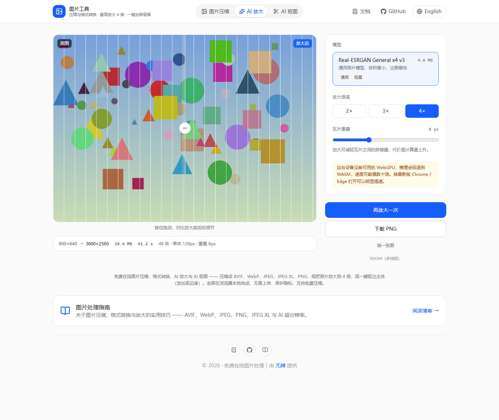

# 图片工具 · Image Tools

[](https://opensource.org/licenses/MIT)

[English](./README.md) | **简体中文**

浏览器端的图片工具箱：**压缩 / 格式转换**（WebAssembly 编解码）＋ **AI 超分辨率放大** ＋ **AI 抠图去背景**
（两者都跑 ONNX Runtime）。所有处理都在访问者自己的设备上完成 —— 图片不上传、不出本机，
产物是一堆静态文件，**不需要任何后端**。

线上地址：<https://img.1day.vip/>
文档：<https://img.1day.vip/docs/>





## 功能

三个工具共用同一套页面外壳，顶栏胶囊标签切换，切换是瞬时的（同一份 bundle，不整页跳转）；
同时各自保留独立 URL，可以分别收藏、分别投放。

### 一、图片压缩 / 格式转换 —— `/`

| 项 | 说明 |
| --- | --- |
| 输出格式 | AVIF、JPEG（MozJPEG）、JPEG XL、PNG（OxiPNG）、WebP |
| 处理方式 | 浏览器本地 WASM 编解码，无上传、无服务端 |
| 批量 | 多选 / 拖拽 / 拖入文件夹，逐张排队处理 |
| 质量 | 每种格式各记一个默认值，切换格式自动回填，滑块拖动即时生效 |
| 结果 | 实时预览、体积缩减百分比、单张下载、「下载全部」批量打包 |

默认质量：AVIF 50、JPEG 75、JPEG XL 75、WebP 75、PNG 无损。

### 二、AI 图片放大 —— `/upscale/`

| 项 | 说明 |
| --- | --- |
| 模型 | Real-ESRGAN General x4v3（ONNX 单文件，4.76 MB 随仓库提交） |
| 倍率 | 4×（瓦片推理后按目标倍率缩放落盘） |
| 后端 | **WebGPU 优先**，不可用时自动降级 WASM（多线程 → 单线程） |
| 交互 | 上传 → 选择模型 → 原图/结果对比滑块 → 下载 |

### 三、AI 抠图 / 去背景 —— `/cutout/`

| 项 | 说明 |
| --- | --- |
| 模型 | BiRefNet（512×512 输入，单次整图推理，输出单通道 alpha 遮罩） |
| 版本 | 轻量版 94 MB（默认推荐）/ 完整版 452 MB（无 WebGPU 时的兼容备用） |
| 权重 | **不随仓库提交**，从 HuggingFace Hub 按固定 revision 拉取并缓存到 Cache Storage |
| 后端 | **WebGPU 优先**，不可用时自动降级 WASM（多线程 → 单线程） |
| 边缘 | 两档：「锐利」收窄过渡带，「柔和」保留原始羽化 |
| 底色 | 透明 / 白 / 红 / 蓝 —— 换底色只重合成，不重跑推理 |
| 交互 | 上传 → 选择模型与边缘 → 抠图 → 对比滑块 → 换底色 → 下载 PNG |

抠图与放大共用同一份 ONNX Runtime（`public/ort/`），**没有引入第二个推理引擎**。

## 技术栈

| 层 | 选型 |
| --- | --- |
| 框架 | React 19 + TypeScript 6 |
| 构建 | Vite 8（MPA 多入口：9 个 HTML） |
| 样式 | Tailwind CSS 4（`@tailwindcss/vite` 插件，CSS-first） |
| 压缩 | [jSquash](https://github.com/jamsinclair/jSquash) 系列 WASM 编解码器 |
| 推理 | [onnxruntime-web](https://github.com/microsoft/onnxruntime) 1.30（WebGPU / WASM） |
| 图标 | lucide-react |
| 部署 | Cloudflare Pages（纯静态） |

## 本地开发

```bash
git clone https://github.com/haihaipypy/image-tools.git
cd image-tools
npm install
npm run dev
```

`npm run dev` 会先跑一次 `prepare:ort` 准备 ONNX Runtime 资源，再起 Vite。**没有任何后端要启动。**

环境要求：Node.js `^20.19.0 || >=22.12.0`（Vite 8 的引擎约束），npm 7+。

常用命令：

| 命令 | 作用 |
| --- | --- |
| `npm run dev` | 准备 ORT 资源 + 起开发服务器（带 COOP/COEP 头） |
| `npm run build` | 准备 ORT 资源 + 类型检查 + 构建 |
| `npm run preview` | 预览 `dist/` |
| `npm run typecheck` / `npm run lint` | 类型检查 / ESLint |
| `npm run deploy` | 构建 + `wrangler pages deploy` |

## 部署

### 方式一：Cloudflare Pages 连接 Git 仓库（推荐）

1. Cloudflare 控制台 → **Workers & Pages** → **Create** → **Pages** → **Connect to Git**
2. 授权并选择仓库 `haihaipypy/image-tools`
3. 构建配置：

   | 设置项 | 值 |
   | --- | --- |
   | Framework preset | None（或 Vite） |
   | Build command | `npm run build` |
   | Build output directory | `dist` |
   | Root directory | 留空 |

4. **加一个环境变量 `NODE_VERSION = 22`** —— Vite 8 要求 Node `^20.19.0 || >=22.12.0`，
   构建镜像的默认版本不一定满足。
5. **Deploy**，等日志跑完。

`wrangler.toml`（`pages_build_output_dir = "./dist"`）已就位。

### 方式二：本地 wrangler

```bash
npm run deploy     # = npm run build && wrangler pages deploy dist --project-name=image-tools
```

首次需要先 `npx wrangler login`（或在 CI 里配 `CLOUDFLARE_API_TOKEN` + `CLOUDFLARE_ACCOUNT_ID`）。

### 方式三：任何静态托管

没有服务端代码，`dist/` 整个丢上去即可 —— EdgeOne Pages、Netlify、nginx 都行。
但有两条硬性要求：

- **必须能设置自定义响应头。** `public/_headers` 是 Cloudflare 的格式，别的平台要换成它自己的写法
  （Netlify 用同名 `_headers`、nginx 用 `add_header`、EdgeOne 用响应头规则）。
  **`Cross-Origin-Opener-Policy: same-origin` + `Cross-Origin-Embedder-Policy: require-corp`
  必须真正生效**，否则无 WebGPU 的机器会掉到单线程 WASM，慢好几倍。
  **GitHub Pages 做不到，不要用它。**
- **`dist/ort/` 与 `dist/models/` 别漏传。** 抠图权重不在 `dist/` 里 —— 它从 HuggingFace
  现拉现缓存，部署时不需要额外准备。

完整的部署细节、换域名清单、代码结构说明见 **<https://img.1day.vip/docs/deployment.html>**。

## 文档

技术细节都搬到了独立的文档站，README 只保留概览：

| 页面 | 内容 |
| --- | --- |
| [介绍](https://img.1day.vip/docs/) | 项目定位与整体结构 |
| [使用方法](https://img.1day.vip/docs/usage.html) | 三个工具怎么用、注意事项、常见问题 |
| [浏览器端推理](https://img.1day.vip/docs/how-it-works.html) | 后端选择、跨域隔离、首次加载体积 |
| [模型说明](https://img.1day.vip/docs/models.html) | 模型来源、授权、参数与选择规则 |
| [部署流程](https://img.1day.vip/docs/deployment.html) | 构建产出、各平台部署、硬约束、换域名 |
| [自定义与扩展](https://img.1day.vip/docs/customize.html) | 换模型、加语言、加工具的代码路径 |
| [许可与版权](https://img.1day.vip/docs/license.html) | 项目、模型权重、依赖库的完整授权清单 |

英文版在 `/en/docs/` 下。

## 许可证与版权

本项目按 **MIT** 发布。完整文本见 [LICENSE](./LICENSE)。

| 对象 | 许可 | 版权归属 |
| --- | --- | --- |
| 本项目代码 | MIT | © 2026 无辣（[haihaipypy](https://github.com/haihaipypy)） |
| 上游基础项目 | MIT | © 2024 Addy Osmani —— 压缩/格式转换部分源自其 image-tools，原始版权声明保留在 [LICENSE](./LICENSE) |
| Real-ESRGAN 模型权重 | BSD-3-Clause | © 2021 Xintao Wang（[Real-ESRGAN](https://github.com/xinntao/Real-ESRGAN)），ONNX 导出由 [Qualcomm AI Hub](https://huggingface.co/qualcomm/Real-ESRGAN-General-x4v3) 提供 |
| BiRefNet 模型权重 | MIT | © 2024 Peng Zheng（[BiRefNet](https://github.com/ZhengPeng7/BiRefNet)），ONNX 导出由 [studioludens](https://huggingface.co/studioludens/birefnet-lite-512) 与 [naddy24](https://huggingface.co/naddy24/birefnet-512-webgpu) 提供 |
| ONNX Runtime Web | MIT | © Microsoft |
| jSquash 及封装的编解码器 | MIT | © James Sinclair；编解码器为 MozJPEG / libavif / libjxl / OxiPNG |
| Lucide 图标 | ISC | Lucide Contributors |
| React / Vite / Tailwind CSS | MIT | 各自所属基金会与作者 |

**关于 Upscayl。** 放大功能的交互形态参考了 [Upscayl](https://github.com/upscayl/upscayl)，
但**代码是重写的，没有复制它的源码**，推理层也完全不同（ONNX Runtime 跑在浏览器里，
而非 Electron + ncnn 原生二进制）。因此本项目不受 Upscayl 的 AGPL-3.0 传染。

**关于 bg0。** 抠图功能的交互与 API 设计参考了 [bg0](https://github.com/opencoredev/bg0)
（Apache-2.0），但**推理层是独立实现的**：依赖树里没有 `@huggingface/transformers`，
也没有 `@bg0/browser`。

完整的授权清单（含模型权重与全部依赖库）见
**<https://img.1day.vip/docs/license.html>**。

## 致谢

[jSquash](https://github.com/jamsinclair/jSquash) ·
[ONNX Runtime](https://github.com/microsoft/onnxruntime) ·
[Real-ESRGAN](https://github.com/xinntao/Real-ESRGAN) ·
[BiRefNet](https://github.com/ZhengPeng7/BiRefNet) ·
[bg0](https://github.com/opencoredev/bg0) ·
[Upscayl](https://github.com/upscayl/upscayl) ·
[Addy Osmani](https://github.com/addyosmani)

## 参与贡献

欢迎提 PR。涉及较大改动时，建议先开 issue 对齐方向。
