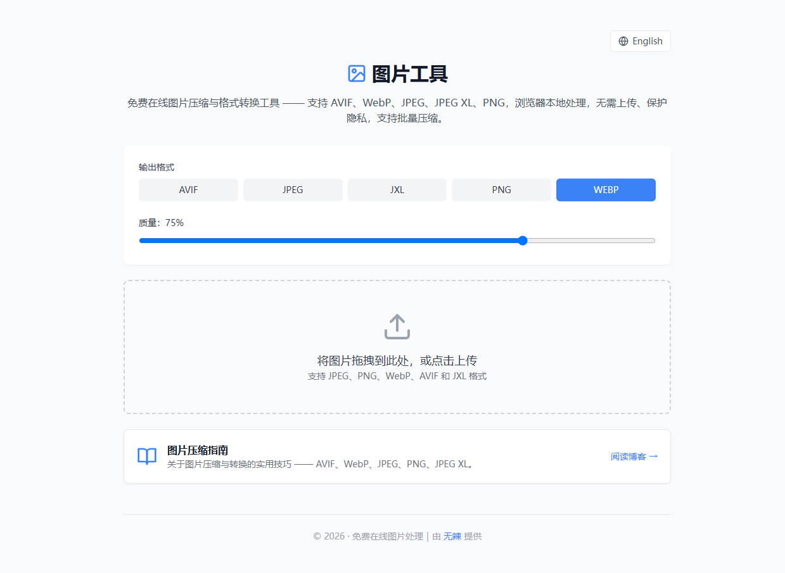

# 图片工具 🎨

[](https://opensource.org/licenses/MIT)

[English](./README.md) | [简体中文](./README_zh.md)

一款基于浏览器的现代图片压缩工具，借助 WebAssembly 实现高性能图片优化。支持多种图片格式，界面直观，无需上传服务器，在浏览器本地即可完成压缩，且不牺牲画质。



## ✨ 功能特性

- 🖼️ 支持多种图片格式：
  - AVIF（AV1 图像格式）
  - JPEG（使用 MozJPEG）
  - JPEG XL
  - PNG（使用 OxiPNG）
  - WebP

- 🚀 核心能力：
  - 浏览器本地压缩（无需上传到服务器）
  - 支持批量处理
  - 格式互转
  - 按格式调节压缩质量
  - 实时预览
  - 体积缩减统计
  - 拖拽上传
  - 大批量文件的智能处理队列

## 🛠️ 技术栈

图片工具采用现代 Web 技术构建：

- React + TypeScript 构建界面
- Vite 提供极速的开发体验
- WebAssembly 提供接近原生的处理速度
- Tailwind CSS 处理样式
- jSquash 提供图片编解码实现

## 🚀 快速开始

### 环境要求

- Node.js 18 或更高版本
- npm 7 或更高版本

### 安装

1. 克隆仓库：
```bash
git clone https://github.com/haihaipypy/image-tools.git
cd image-tools
```

2. 安装依赖：
```bash
npm install
```

3. 启动开发服务器：
```bash
npm run dev
```

4. 构建生产版本：
```bash
npm run build
```

## 💡 使用方法

1. **拖放或选择图片**：把图片拖到上传区域，或点击选择文件
2. **选择输出格式**：挑一个输出格式（AVIF、JPEG、JPEG XL、PNG 或 WebP）
3. **调节质量**：拖动质量滑块，在文件体积和画质之间找平衡
4. **下载**：单独下载，或用「下载全部」按钮批量下载

## 🔧 默认质量设置

- AVIF：50%
- JPEG：75%
- JPEG XL：75%
- PNG：无损
- WebP：75%

## 🌐 多语言与页面路径

站点默认中文，英文版放在 `/en/` 路径下：

| 语言 | 路径 |
| --- | --- |
| 中文（默认） | `/`、`/blog/` |
| 英文 | `/en/`、`/en/blog/` |

旧的 `/zh-CN/` 路径保留作兼容，会规范化到新的中文根路径。

## 🤝 参与贡献

欢迎贡献！请随时提交 Pull Request。涉及重大改动时，请先开 issue 讨论。

1. Fork 本仓库
2. 创建特性分支（`git checkout -b feature/AmazingFeature`）
3. 提交改动（`git commit -m 'Add some AmazingFeature'`）
4. 推送分支（`git push origin feature/AmazingFeature`）
5. 发起 Pull Request

## 📝 许可证

本项目基于 MIT 许可证开源，详见 [LICENSE](LICENSE) 文件。

## 🙏 致谢

- [jSquash](https://github.com/jamsinclair/jSquash) 提供 WebAssembly 图片编解码器
- [MozJPEG](https://github.com/mozilla/mozjpeg) 提供 JPEG 压缩
- [libavif](https://github.com/AOMediaCodec/libavif) 提供 AVIF 支持
- [libjxl](https://github.com/libjxl/libjxl) 提供 JPEG XL 支持
- [Oxipng](https://github.com/shssoichiro/oxipng) 提供 PNG 优化
